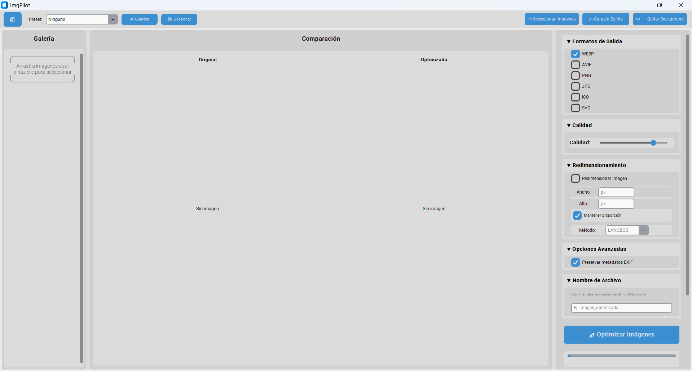
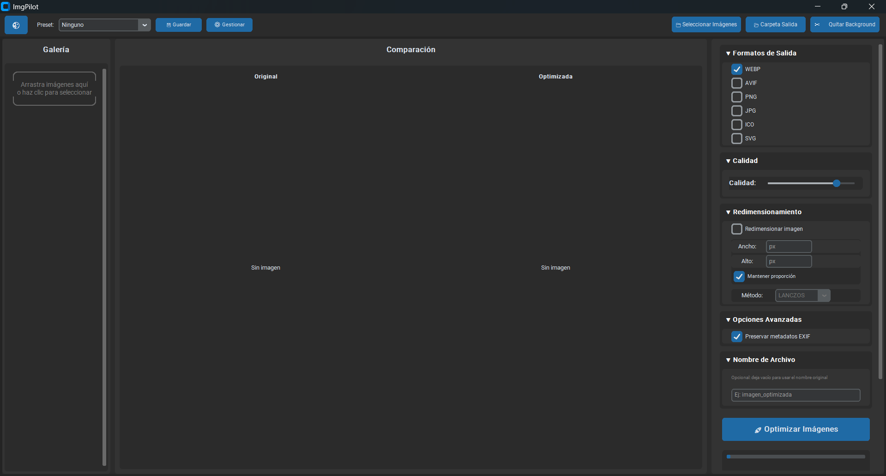

# ImgPilot

Modern desktop application with a beautiful GUI for optimizing images and converting them to multiple formats (WebP, AVIF, PNG, JPG, ICO, SVG) with advanced compression, resizing, batch processing, background removal, and vectorization features.

## 📸 Screenshots

<div align="center">
  
  <p><em>Main application window - Light theme</em></p>
</div>

<div align="center">
  
  <p><em>Main application window - Dark theme</em></p>
</div>

## ✨ Features

### Format Conversion
- ✅ **WebP**: Modern format with excellent compression
- ✅ **AVIF**: Next-generation format with superior compression
- ✅ **PNG**: Lossless, preserves transparency
- ✅ **JPG/JPEG**: Universal format with quality control
- ✅ **ICO**: Multiple sizes for icons
- ✅ **SVG**: Vectorization from raster images

### Advanced Features
- 🎨 **Modern Interface**: Minimalist design with light/dark mode
- 🖼️ **Thumbnail Gallery**: Preview all selected images
- 🔄 **Before/After Comparison**: Side-by-side view with compression statistics
- 📦 **Drag & Drop**: Drag images directly from file explorer
- 💾 **Preset System**: Save and load custom configurations
- 📊 **Batch Processing**: Optimize multiple images at once
- 🎚️ **Quality Control**: Adjustable slider (0-100)
- 📐 **Resizing**: Multiple algorithms (Lanczos, Bicubic, Bilinear, Nearest)
- 📸 **EXIF Preservation**: Option to maintain metadata
- 📈 **Detailed Statistics**: Original vs optimized size, compression percentage
- ✂️ **Background Removal**: AI-powered background removal using rembg
- 🎯 **SVG Vectorization**: Convert raster images to scalable vector graphics

## 📋 Requirements

- Python 3.8 or higher (Python 3.11-3.12 recommended for best compatibility)
- Operating System: Windows, Linux, or macOS

## 🚀 Installation

### 1. Clone the repository

```bash
git clone https://github.com/ErickHdzV/ImgPilot.git
cd imgpilot
```

### 2. Create a virtual environment (recommended)

```bash
python -m venv venv
```

**Windows:**
```bash
venv\Scripts\activate
```

**Linux/macOS:**
```bash
source venv/bin/activate
```

### 3. Install dependencies

```bash
pip install -r requirements.txt
```

**Note:** On Windows with Python 3.14+, some packages may require compilation tools. If you encounter issues:
- Install [Visual Studio Build Tools](https://visualstudio.microsoft.com/downloads/#build-tools-for-visual-studio-2022) (select "C++ build tools")
- Or use Python 3.11/3.12 for better pre-compiled package support

### 4. Optional: AVIF Support

AVIF support is optional. The application works perfectly without it.

```bash
pip install pillow-heif
```

## 💻 Usage

### Start the application

```bash
python main.py
```

### Command line options

```bash
# Change theme
python main.py --theme dark    # Dark theme
python main.py --theme light   # Light theme
python main.py --theme system  # Follow system theme

# Change color theme
python main.py --color-theme blue       # Blue
python main.py --color-theme green     # Green
python main.py --color-theme dark-blue # Dark blue
```

### Usage Guide

1. **Select Images**:
   - Click "📁 Select Images" or
   - Drag images directly from the file explorer to the window

2. **Browse Gallery**: 
   - Selected images appear as thumbnails in the left panel
   - Click a thumbnail to view it in the comparison view

3. **Configure Options**:
   - **Output Formats**: Select one or more formats (WebP, AVIF, PNG, JPG, ICO, SVG)
   - **Quality**: Adjust the slider (0-100)
   - **Resizing** (optional):
     - Enable "Resize image"
     - Specify width and/or height in pixels
     - Check "Maintain aspect ratio" to preserve proportions
   - **Advanced Options**:
     - Preserve EXIF metadata
     - Resize method

4. **Use Presets** (optional):
   - Select a preset from the dropdown in the top bar
   - Or save your current configuration as a new preset

5. **Select Output Folder** (optional): 
   - By default, files are saved in the same folder as the original images

6. **Remove Background** (optional):
   - Select an image from the gallery
   - Click "✂️ Remove Background" button
   - The result will be saved as PNG with transparency

7. **Optimize**: 
   - Click "🚀 Optimize Images"
   - Watch real-time progress
   - Review results in the comparison panel

## 📁 Supported Formats

### Input
- JPEG (.jpg, .jpeg)
- PNG (.png)
- BMP (.bmp)
- TIFF (.tiff, .tif)
- WebP (.webp)
- AVIF (.avif)
- ICO (.ico)

### Output
- **WebP**: Excellent compression, widely supported
- **AVIF**: Better compression than WebP, requires pillow-heif
- **PNG**: Lossless, preserves transparency
- **JPG**: Universal format, quality control
- **ICO**: Multiple sizes for icons
- **SVG**: Vector graphics from raster images

## 💡 Quality Recommendations

- **Web - Balanced**: 75-85 (good quality/size balance)
- **High Quality**: 90-95 (for important images)
- **Maximum Compression**: 60-75 (significantly reduce size)
- **Very High Compression**: 40-60 (only if size is critical)

## 🏗️ Project Structure

```
imgpilot/
├── main.py                      # Entry point
├── gui/
│   ├── __init__.py
│   ├── main_window.py           # Main window
│   ├── components.py             # Reusable components
│   ├── preset_manager.py         # Preset manager
│   ├── drag_drop.py             # Drag & drop functionality
│   └── app_state.py             # Application state
├── image_processor/
│   ├── __init__.py
│   ├── converter.py             # Format conversion
│   ├── optimizer.py             # Quality optimization
│   ├── resizer.py               # Resizing
│   ├── background_remover.py    # Background removal
│   └── svg_converter.py         # SVG vectorization
├── utils/
│   ├── __init__.py
│   └── file_handler.py          # File handling
├── requirements.txt             # Dependencies
├── config.py                    # Configuration
├── .gitignore                   # Git ignored files
└── README.md                    # This file
```

## 🛠️ Technologies Used

- **Python 3.8+**: Programming language
- **CustomTkinter**: Modern GUI framework
- **Pillow (PIL)**: Image processing
- **rembg**: AI-powered background removal
- **OpenCV**: Image processing for vectorization
- **svgwrite**: SVG file generation
- **pillow-heif**: AVIF format support (optional)
- **tkinterdnd2**: Enhanced drag & drop support (optional)

## 🐛 Troubleshooting

### Error: "AVIF not available"
- Install `pillow-heif`: `pip install pillow-heif`
- Or continue using WebP (which is also excellent)

### Error: "No write permissions"
- Verify you have write permissions in the output folder
- Try selecting a different folder
- On Windows, run as administrator if necessary

### Drag & drop doesn't work
- Make sure `tkinterdnd2` is installed: `pip install tkinterdnd2`
- If not installed, you can use the "Select Images" button

### Error opening images
- Verify that files are valid images
- Some formats may not be supported
- Try with JPEG or PNG images

### Background removal not working
- Install `rembg`: `pip install rembg`
- Note: First run will download AI models (may take a few minutes)
- Requires internet connection for first use

### SVG conversion issues
- Install required packages: `pip install opencv-python svgwrite`
- On Windows with Python 3.14+, you may need Visual Studio Build Tools
- Consider using Python 3.11/3.12 for better compatibility

### Python 3.14 compatibility issues
- The application includes compatibility patches for Python 3.14
- For best results, use Python 3.11 or 3.12
- Some packages may require compilation tools on Windows

## 📝 Notes

- Original files are **never modified**. New files are always created with optimized formats.
- Processing runs in the background to avoid blocking the interface.
- Presets are saved in `~/.imgpilot/presets.json`
- For very large images, processing may take several seconds.
- Background removal uses AI models that are downloaded on first use.

## 📄 License

This project is open source and available under the MIT License. See the `LICENSE` file for more details.

## 🤝 Contributing

Contributions are welcome! If you find any bugs or have suggestions:

1. Open an [issue](https://github.com/ErickHdzV/imgpilot/issues) to report bugs or suggest features
2. Submit a [pull request](https://github.com/ErickHdzV/imgpilot/pulls) with your improvements

## 👤 Author

1. Made with ❤️ by [Erick HV](https://x.com/ErickHe52896723)
2. Github: [ErickHdzV](https://github.com/ErickHdzV)

⭐ If you like this project, give it a star on GitHub!

